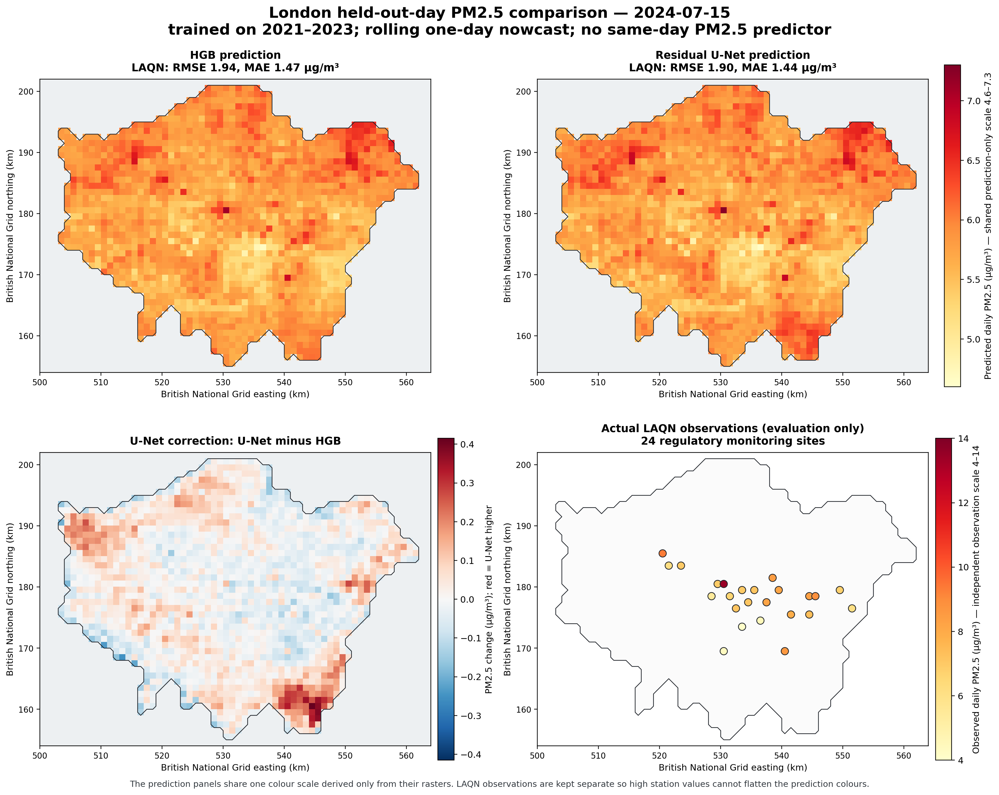
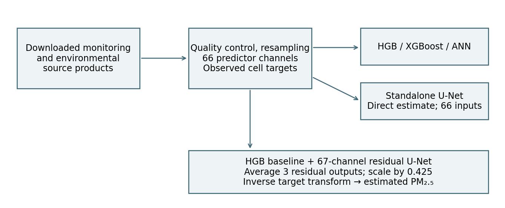

# Aitken

**Urban PM2.5 mapping with environmental data and machine learning**

A research project combining real monitoring observations, satellite products,
weather and geographic data to estimate daily PM2.5 on a 1 km grid. The current
case study covers **Greater London, 2021–2024** and compares gradient-boosted
trees, an ANN, a hybrid HGB + residual U-Net and a standalone U-Net.

**Status:** research documentation and an executable dashboard. The reported
experiments are complete; the dashboard explores saved outputs without retraining.
Training code, data-access tooling and the manuscript are planned for later
releases. Generalisation to other cities and operational forecasting have not
yet been demonstrated.

[Data sources](docs/DATA_SOURCES.md) · [Research protocol](docs/RESEARCH_PROTOCOL.md) ·
[Results](results/README.md) · [Dashboard setup](dashboard/README.md) · [Roadmap](ROADMAP.md)

## Interactive dashboard

Choose any date in **2024** and a model to render its saved London heatmap.
Compare all seven model results, inspect daily monitoring-site error, change
colour scales, outline relative hotspots and download a labelled PNG.

Requires Node.js 22.18 or newer; no Python, GPU or training data is needed to run it.
From this repository:

```powershell
npm --prefix dashboard ci
npm --prefix dashboard run dev
```

Open the local address printed by the command. See [dashboard documentation](dashboard/README.md)
for production builds and [technical handover](docs/DASHBOARD.md) for the data contract.
Five model variants have full-grid maps. ANN and XGBoost currently have scores
only. This is a **retrospective prediction archive, not a live forecasting service**.



*A pre-specified example from 15 July 2024. Values between monitors are model
estimates. The observation and correction panels use their own labelled scales.*

## Research question

How much does a spatial U-Net correction add to a strong tabular PM2.5 model
when both use the same environmental predictors and regulatory evaluation
observations?

The completed local study includes data preparation, source-aware supervision,
baseline and neural model comparisons, spatial maps, saved-artifact audits and
a draft manuscript. This repository presents its research scope, aggregate
results and a runnable prediction-archive dashboard.

## Study at a glance

| Item | Scope |
|---|---|
| Region | Greater London; 1,719 in-domain cells |
| Grid | 1 km, EPSG:27700, 48 × 64 tensor |
| Data period | 2021–2024 |
| Final fitting period | 2021–2023 |
| Prepared observations | 444,202 station-days across LAQN and Breathe London |
| Common evaluation | 9,619 LAQN station-days over 349 dates in 2024 |
| Final predictors | 66 selected environmental and prior-day-history channels |
| Label provenance | Downloaded observations; no synthetic PM2.5 training labels |

## Method



Observations are quality-controlled and aligned with weather, satellite and
static covariates. The hybrid U-Net receives the 66 predictor maps plus an HGB
baseline map. It predicts a correction in standardised log-PM2.5 space, followed
by inverse transformation to concentration. The separate standalone U-Net uses
the 66 predictors without HGB input or a baseline addition.

The PM2.5 history features use only earlier days. Environmental-product timing,
including quarterly composites, makes this **retrospective daily mapping and
nowcasting**, rather than an operational future forecast.

## Results

All rows below use the same available 2024 LAQN observations. MAE and RMSE are
in µg/m³; lower is better. R² is dimensionless and is not percentage accuracy.

| Model | MAE | RMSE | R² |
|---|---:|---:|---:|
| Hybrid HGB + residual U-Net (3 seeds) | 2.3405 | 3.7765 | 0.5179 |
| HGB (unconstrained) | 2.3550 | 3.7920 | 0.5139 |
| HGB (limited monotonic) | 2.4344 | 3.8471 | 0.4997 |
| XGBoost | 2.3712 | 3.8739 | 0.4927 |
| ANN (5 seeds) | 2.5768 | 4.0871 | 0.4353 |
| Standalone U-Net (3 seeds) | 2.4891 | 4.1227 | 0.4254 |
| Standalone U-Net (seed 42) | 2.5963 | 4.2816 | 0.3803 |

The hybrid has the lowest numerical RMSE, but its difference from HGB is only
about 0.0155 µg/m³. The final descriptive paired-day interval includes zero;
these results do not establish decisive superiority or statistical equivalence.
The standalone single-model row uses pre-specified seed 42, not the best seed
selected after inspecting 2024.

Read the [research protocol](docs/RESEARCH_PROTOCOL.md) for uncertainty and
evaluation history, and [result provenance](results/README.md) for the scope
of the published evidence.

## Repository structure

```text
Aitken/
  README.md                    Research overview, methods and results
  docs/
    DATA_SOURCES.md            Source products and data availability
    RESEARCH_PROTOCOL.md       Evaluation design and interpretation
  results/
    README.md                  Result scope and figure explanations
    metrics.csv                Aggregate seven-model comparison
    provenance.json            Published-file hashes and source identifiers
    figures/                   Maps, pipeline and RMSE comparison
  ROADMAP.md                   Code, manuscript and research release stages
  dashboard/                   React dashboard, tests and derived map archive
  scripts/                     Saved-output exporter and static-build staging
```

## Code, data and paper availability

| Material | Current status |
|---|---|
| Project documentation and selected figures | Included in this repository |
| Aggregate evaluation metrics | Included in `results/metrics.csv` |
| Dashboard and derived 2024 map archive | Included in `dashboard/` |
| Acquisition, preparation and model code | Completed locally; public release planned |
| Raw/processed data and checkpoints | Not distributed in this release |
| Manuscript | Unpublished draft; public release planned |
| Presentation | Public research edition planned |

The dashboard runs independently from the original London bundle. This is still
not an executable training package: acquisition, feature preparation and model
training remain in the separate local bundle. See the [roadmap](ROADMAP.md).

The earlier synthetic-data prototype is a separate development stage. Its
results are not used as evidence for this London study.

## Limitations and next work

The 2024 benchmark had been inspected in earlier experiments. Evaluation is at
monitoring locations rather than every map cell, and high-pollution events
remain underpredicted. Residual training used in-sample HGB maps. Quarterly
satellite composites also limit claims about information available in real time.

Planned work includes out-of-fold baseline maps, untouched temporal and
station-held-out evaluation, and uncertainty analysis. These experiments are
not presented as completed.

## Project name

**Aitken** is named in reference to John Aitken's research on atmospheric dust
particles. His historical work provides the inspiration for the name, not a
claim that this project implements his instruments.
[Original research](https://doi.org/10.1017/S0080456800017592).

Source products and their roles are documented in the
[data-source guide](docs/DATA_SOURCES.md).

The code licence and data redistribution plan are pending. No published paper,
DOI or publicly hosted study dataset is claimed. Research documents will be
identified by their actual publication status when released.
