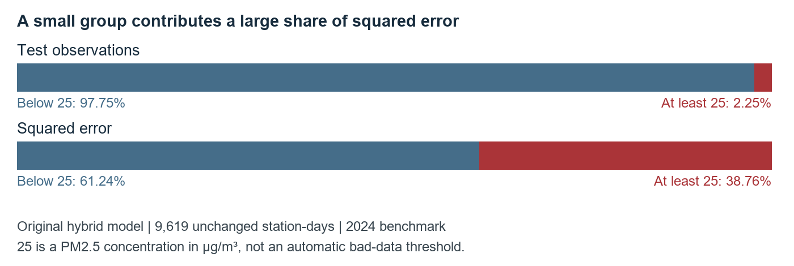

# London PM25 Model Comparison and High Pollution Error Analysis

Aitken project • Technical review in simple terms • 12 September 2026

### 1 Main conclusion

Keep the original hybrid HGB plus residual U-Net as the current project model. It has the lowest numerical error in our existing matched comparison, but its improvement over HGB alone is small. The main unresolved weakness is underprediction during high-pollution episodes. The completed training-value capping test did not provide a useful final improvement. [[1]](https://github.com/r9jdp/Aitken/blob/main/results/metrics.csv) [[9]](https://github.com/r9jdp/Aitken/blob/main/results/outlier_sensitivity_20260909/REPORT.md)

### Our original model comparison

| Model | MAE | RMSE | R² |
| --- | --- | --- | --- |
| Hybrid HGB + residual U-Net (3 seeds) | 2.3405 | 3.7765 | 0.5179 |
| HGB (unconstrained) | 2.3550 | 3.7920 | 0.5139 |
| HGB (limited monotonic) | 2.4344 | 3.8471 | 0.4997 |
| XGBoost | 2.3712 | 3.8739 | 0.4927 |
| ANN (5 seeds) | 2.5768 | 4.0871 | 0.4353 |
| Standalone U-Net (3 seeds) | 2.4891 | 4.1227 | 0.4254 |
| Standalone U-Net (seed 42) | 2.5963 | 4.2816 | 0.3803 |

All rows use the same 9,619 LAQN station-days in 2024, after training on 2021–2023. MAE is the average absolute miss; RMSE penalises large misses more strongly. Both are in µg/m³; lower is better. R² is unitless; higher is better. Seeds are different training initialisations whose predictions are averaged. These are the existing release results, not newly retrained models. [[1]](https://github.com/r9jdp/Aitken/blob/main/results/metrics.csv)

The hybrid reduces RMSE by only 0.0155 µg/m³, about 0.41%, compared with unconstrained HGB. The saved paired calendar-day bootstrap interval for HGB-minus-hybrid RMSE is approximately −0.00003 to +0.0283 µg/m³. Because it includes zero, the numerical lead is not decisive evidence of superiority. [[1]](https://github.com/r9jdp/Aitken/blob/main/results/metrics.csv)

High PM2.5 readings make up 2.25% of this benchmark but contribute 38.76% of its squared error. This report explains that failure without removing difficult observations or claiming that high values are automatically noise.

## 2 What our product does and how it was evaluated

### The model in plain language

HGB means histogram-based gradient boosting. HGB and XGBoost learn from tables of environmental and location features using boosted decision trees. The ANN is a fully connected artificial neural network. Standalone U-Net learns a pollution map directly from spatial input layers. The hybrid first makes an HGB estimate, then uses U-Net to learn a spatial correction. [[1]](https://github.com/r9jdp/Aitken/blob/main/results/metrics.csv) [[8]](https://arxiv.org/abs/1505.04597)

The implementation combines the hybrid correction in standardised logarithmic concentration space, then converts the result back to µg/m³. The correction multiplier is 0.425. Therefore, “HGB estimate plus U-Net correction” is a useful explanation, but it is not a literal addition of two independent raw-concentration maps. The standalone U-Net has 66 input channels and no HGB input; the hybrid has the additional HGB map. [[1]](https://github.com/r9jdp/Aitken/blob/main/results/metrics.csv)

### Data and output

The output is a daily 1 km Greater London grid in the British National Grid coordinate system. Each tensor contains 48 × 64 cells; 1,719 cells intersect London. Training combines LAQN monitoring observations and Breathe London observations, while the reported benchmark uses LAQN observations. Environmental inputs include ERA5 weather, Sentinel-5P atmospheric products, Sentinel-2 surface indices, land and location features, and earlier PM2.5 observations. The final model excludes five fire and smoke channels. [[1]](https://github.com/r9jdp/Aitken/blob/main/results/metrics.csv)

The pipeline already filters invalid hourly values, removes duplicate hours, requires at least 18 valid hours for a daily monitor value, and uses medians when combining monitors in a cell. These checks do not prove that every remaining value is error-free, but a reading above 25 µg/m³ is not sufficient evidence to delete it. [[1]](https://github.com/r9jdp/Aitken/blob/main/results/metrics.csv) [[9]](https://github.com/r9jdp/Aitken/blob/main/results/outlier_sensitivity_20260909/REPORT.md)

### What the benchmark does and does not establish

The saved predictions cover 349 evaluated dates from 1 January to 14 December 2024, not every day of the calendar year. A station-day means one evaluated station on one date. Missing observations are not filled in to improve the score. The aggregate errors are calculated over station-days, so dates with more reporting stations receive more weight.

No same-day PM2.5 observation is used as an input. Earlier PM2.5 readings can be available during rolling evaluation. However, same-day environmental data and retrospective products are used, so this is retrospective daily mapping or nowcasting, not a demonstrated operational future forecast. The 2024 benchmark has already been examined and is not an untouched confirmatory test. [[1]](https://github.com/r9jdp/Aitken/blob/main/results/metrics.csv)

Monitor-based accuracy does not validate every map cell or establish performance at entirely unseen stations. A bright area on a heatmap is a higher model estimate, not proof of a measured hotspot. Changing the colour scale improves readability but does not change prediction accuracy.

## 3 Comparison with published research

The most relevant main comparison is the Greater London daily 1 km ensemble study by Danesh Yazdi et al. [[2]](https://doi.org/10.3390/rs12060914). Recent London studies and a recent U-Net study are also included. This is a focused literature comparison, not a systematic review or a reproduction of those studies.

| Study and task | Reported R² | Reported RMSE | Important difference |
| --- | --- | --- | --- |
| Our original hybrid [[1]](https://github.com/r9jdp/Aitken/blob/main/results/metrics.csv) Daily London maps | 0.518 | 3.777 | 9,619 LAQN station-days; 2024 temporal benchmark. |
| Danesh Yazdi et al., 2020 [[2]](https://doi.org/10.3390/rs12060914) Daily 1 km London | 0.828 | 4.231 | 2005–2013; monitor-held-out 10-fold CV; AOD and augmented target archive. |
| Dimakopoulou et al., 2022 [[3]](https://pmc.ncbi.nlm.nih.gov/articles/PMC9103954/) Daily London exposure | 0.66–0.83 across models | Not used here | 2009–2013; combinations include regional pollution and dispersion information. |
| Schneider et al., 2020 [[4]](https://pmc.ncbi.nlm.nih.gov/articles/PMC7116547/) Daily 1 km Great Britain | 0.767 mean CV | Not verified here | Nationwide, not London-only; satellite and atmospheric-model inputs. |
| Legaria-Santiago et al., 2026 [[5]](https://arxiv.org/html/2608.23219v1) Hourly London sites | 0.53 / 0.69 | 3.32 / 2.41 | Scenario 2: Marylebone / Camden; traffic and neighbouring pollution. |
| Galindo-Prieto et al., 2026 [[6]](https://analyticalsciencejournals.onlinelibrary.wiley.com/doi/10.1002/cem.70156) Daily London station CT3 | 0.796 | 2.261 RMSEP | Original-scale PLS test result; other-station information; not a city-wide map. |

CV means cross-validation; AOD means aerosol optical depth; PLS means partial least squares regression. RMSE and RMSEP are in µg/m³. “Not verified” or “not used” does not mean zero. The 0.66–0.83 range is across models, not a confidence interval; that paper’s hybrids report R² 0.81 and 0.79 and are not HGB plus U-Net. [[3]](https://pmc.ncbi.nlm.nih.gov/articles/PMC9103954/)

These are author-reported results, not a head-to-head ranking. The main London study reports R² 0.828 and RMSE 4.231; our hybrid reports 0.518 and 3.777. Years, pollution variability, targets and validation differ. Some papers use regression-based R²; ours compares prediction squared error with observed variation around its mean. A common benchmark would be needed to establish superiority. [[1]](https://github.com/r9jdp/Aitken/blob/main/results/metrics.csv) [[2]](https://doi.org/10.3390/rs12060914) [[4]](https://pmc.ncbi.nlm.nih.gov/articles/PMC7116547/)

### Recent research using a U Net

AirQ-ResUNet, published in 2025, uses a residual U-Net-style model to emulate an air-pollution dispersion model in Oslo. It supports the relevance of spatial neural networks, but uses a different city and simulator-derived targets. The accessible publisher preview did not provide verifiable numerical performance, so no score is invented here. [[7]](https://link.springer.com/chapter/10.1007/978-3-031-97992-7_3)

## 4 High concentrations account for disproportionate error

The following values were recomputed from the original hybrid’s saved predictions. Every one of the 9,619 evaluation observations was retained. “High” means observed PM2.5 at least 25 µg/m³ for this diagnostic only; it is not AQI, a health classification or a rule for identifying bad measurements.

| Observed group | Count | MAE | RMSE | Bias | Squared error share |
| --- | --- | --- | --- | --- | --- |
| All observations | 9,619 | 2.34 | 3.78 | -0.77 | 100.00% |
| Below 25 | 9,403 | 2.07 | 2.99 | -0.47 | 61.24% |
| At least 25 | 216 | 14.07 | 15.69 | -14.07 | 38.76% |

MAE, RMSE and bias are in µg/m³. Bias is prediction minus observation; a negative value means underprediction. Source: comparison/evidence/high_pollution_diagnosis.json, generated without training or changing observations.

All 216 high observations were underpredicted. Their mean observed concentration was 30.42 µg/m³, but the mean prediction was 16.35 µg/m³. The typical absolute miss was 14.07 µg/m³, compared with 2.07 µg/m³ below 25.

R² and RMSE are strongly affected by large misses because they use squared errors. Missing by 20 contributes 400 squared units; missing by 5 contributes 25. The larger miss counts 16 times as much. This explains why a small number of difficult observations can substantially lower the overall R².

This is an error-concentration diagnosis, not proof that those measurements are noise. Deleting high observations from the test would change what is being evaluated rather than solve the prediction failure.

## 5 Episode examples and likely reasons

The first five rows below are the dates contributing the most squared error in the saved benchmark. They are retrospective diagnostic examples, not newly selected test cases. The final row is the previously used ordinary-day map example. Means refer only to stations evaluated on that date, not an area-weighted city average. Means and RMSE are in µg/m³.

| Date | Sites | Observed mean | Predicted mean | RMSE | Share of total squared error |
| --- | --- | --- | --- | --- | --- |
| 2024-03-11 | 33 | 34.76 | 11.09 | 23.85 | 13.68% |
| 2024-03-07 | 33 | 30.15 | 15.57 | 14.98 | 5.40% |
| 2024-09-19 | 26 | 24.35 | 9.43 | 15.15 | 4.35% |
| 2024-03-08 | 33 | 26.71 | 13.63 | 13.37 | 4.30% |
| 2024-11-05 | 28 | 33.63 | 19.68 | 14.22 | 4.13% |
| 2024-07-15 | 24 | 7.29 | 6.02 | 1.90 | 0.06% |

On 11 March, 33 stations averaged 34.76 µg/m³ while the hybrid averaged 11.09. That one day contributed 13.68% of the entire benchmark’s squared error. March contributed 29.94%. The July example’s lower error must not be presented as representative of all pollution conditions.

### A mismatch between the training loss and the score

The fixed HGB prediction gives 71% weight to a log-target model and 29% to a direct-concentration model. The U-Net correction is also learned in log space with SmoothL1 loss. Log compression and SmoothL1 give very large absolute errors less dominance than raw squared error does. This could help explain conservative peak predictions, but it does not prove causation: the choices helped earlier validation, and the HGB blend still includes a direct model. [[1]](https://github.com/r9jdp/Aitken/blob/main/results/metrics.csv)

### Limited information about an emerging episode

Our PM2.5 history uses earlier days, not today’s measured concentrations. Some London studies also use same-day regional pollution, aerosol optical depth or atmospheric-model information. Those inputs can convey a regional episode more directly. Our Sentinel-5P aerosol index is not the same measurement as aerosol optical depth. A controlled input comparison is needed to measure the effect. [[1]](https://github.com/r9jdp/Aitken/blob/main/results/metrics.csv) [[2]](https://doi.org/10.3390/rs12060914) [[3]](https://pmc.ncbi.nlm.nih.gov/articles/PMC9103954/) [[4]](https://pmc.ncbi.nlm.nih.gov/articles/PMC7116547/)

### What we have not established

A peak across many stations is consistent with a broader episode, but this analysis has not attributed the March event to weather, transported smoke, chemistry or sensor faults. Possible site-versus-grid differences, source differences and changing conditions also need investigation. None of these explanations justifies labelling every high reading an outlier.

## 6 What the completed capping experiment found

We tested gentle upper winsorisation: values above a training-only percentile were capped, not replaced with the median. Input features, masks, weights, scaling, architecture and loss stayed fixed. Only experimental training-target copies changed; HGB maps and all validation/test observations stayed unchanged. All error measures below are in µg/m³. [[9]](https://github.com/r9jdp/Aitken/blob/main/results/outlier_sensitivity_20260909/REPORT.md) [[10]](https://docs.scipy.org/doc/scipy/reference/generated/scipy.stats.mstats.winsorize.html)

### Development comparison on 2023

| Model and treatment | RMSE | MAE | MAE at least 25 | Decision |
| --- | --- | --- | --- | --- |
| Standalone control | 3.2897 | 2.2155 | 8.1180 | Reference |
| Standalone 99.5th cap | 3.2785 | 2.2065 | 8.0964 | Passed |
| Standalone 99th cap | 3.2348 | 2.1834 | 7.6930 | Selected |
| Hybrid control | 3.1452 | 2.1044 | 6.9546 | Reference |
| Hybrid 99.5th cap | 3.1456 | 2.1052 | 6.9678 | Failed |
| Hybrid 99th cap | 3.1410 | 2.1045 | 6.9987 | Failed |

Training used 2021–2022, seed 42 and matched fresh initialisation. The 99.5th and 99th percentile caps were 43.83 and 38.58 µg/m³, changing 551 and 1,101 training cell targets. A cap had to improve RMSE without worsening overall or high-pollution MAE. Neither hybrid treatment passed all conditions. [[9]](https://github.com/r9jdp/Aitken/blob/main/results/outlier_sensitivity_20260909/REPORT.md)

### Standalone confirmation on the original 2024 observations

| Matched three-seed model | MAE | RMSE | R² | High MAE |
| --- | --- | --- | --- | --- |
| Fresh uncapped control | 2.4464 | 4.0592 | 0.4430 | 15.9819 |
| 99th percentile cap | 2.4728 | 4.1435 | 0.4196 | 16.7066 |

After fitting 2021–2023 with seeds 42, 11 and 22, the selected cap was 35.7735 µg/m³ and changed 2,035 training cell-days. RMSE became worse by 0.0843 µg/m³. The paired seven-day-block 95% interval was +0.0016 to +0.1790, from 5,000 resamples. High-pollution MAE also worsened by 0.7247 µg/m³. [[9]](https://github.com/r9jdp/Aitken/blob/main/results/outlier_sensitivity_20260909/REPORT.md)

These fresh matched controls are not the historic standalone row on page 1; do not swap them into the product table or compare an experimental cap with an unmatched old run. The interval measures calendar-block variation for the fitted ensembles, not every possible training run. No hybrid cap was retested on 2024 after failing development screening. [[9]](https://github.com/r9jdp/Aitken/blob/main/results/outlier_sensitivity_20260909/REPORT.md)

Verdict: do not adopt capping. The original implementation remains the product. Keeping the negative experiment in GitHub records what was tested; it does not activate that treatment or identify faulty measurements.

## 7 Limitations and recommended next steps

### What can be claimed now

The product produces daily London PM2.5 estimates and maps, and supports comparison among several models on a common benchmark. The hybrid has the best numerical release result, with a small and statistically uncertain advantage over HGB alone. Standalone U-Net did not outperform the tree baselines in this experiment. [[1]](https://github.com/r9jdp/Aitken/blob/main/results/metrics.csv)

The model is not a proven noise detector, an explanation of atmospheric causes or a system validated at every London location. U-Net is not guaranteed to outperform a tree model simply because it is a spatial neural network.

### Priorities for later controlled experiments

| Priority | Proposed check | What would count as evidence |
| --- | --- | --- |
| 1  Audit episodes | Trace units, timestamps, monitor quality flags and nearby station agreement for large misses. Preserve high readings unless a concrete quality issue is found. | A documented data defect, or retained measurements with a clear audit trail. |
| 2  Match the objective | Compare the existing loss/blend with carefully chosen raw-error or peak-aware alternatives on development years only. | Better overall RMSE without sacrificing ordinary-day or peak MAE, across matched seeds. |
| 3  Check residual training | Use out-of-fold HGB training predictions for the U-Net correction instead of in-sample baseline maps. | A matched experiment tests whether the residual training task becomes more realistic. |
| 4  Check missing information | Test episode-relevant atmospheric inputs only if reliable data and their time of availability can be established. | An ablation isolates the added input; no same-day target leakage. |
| 5  Validate the claim | Use new time periods and station-held-out tests; evaluate peak errors and spatial behaviour separately. | Results support the intended future-date and unseen-location use cases. |

These are recommendations, not changes made for this report. The current pipeline already contains source/density weighting and earlier tuning; proposed alternatives need to be compared against those existing choices. Do not keep tuning against the already examined 2024 benchmark. [[1]](https://github.com/r9jdp/Aitken/blob/main/results/metrics.csv) [[9]](https://github.com/r9jdp/Aitken/blob/main/results/outlier_sensitivity_20260909/REPORT.md)

### Suggested wording for faculty

“Our hybrid combines an HGB estimate with a U-Net spatial correction. It is the best numerical model in our current comparison, with RMSE 3.78 µg/m³ and R² 0.518, although the gain over HGB is small. Our main weakness is pollution peaks: 216 high observations cause about 39% of squared error. We tested gentle training-data capping, but it did not improve the final result, so we retained the original model. Published London studies are useful reference points, but their data and evaluation settings differ.”

### Reproducibility record

Own-model scores come from results/metrics.csv; the completed cap test comes from results/outlier_sensitivity_20260909. New aggregates and the source-prediction SHA-256 are in comparison/evidence/high_pollution_diagnosis.json. comparison/README.md gives reproduction commands, and sources.json records paper tables and caveats. This report adds no training, observations or model changes.

## 8 References

Numbered references are clickable in both report formats. Publication details and quantitative claims were checked against primary publisher pages or author manuscripts on 12 September 2026. Older London papers are retained for direct task relevance; the 2025–2026 studies provide recent context.

[1] Aitken project, London model performance and research protocol, saved release results, Sep. 2026. [Online source](https://github.com/r9jdp/Aitken/blob/main/results/metrics.csv).

[2] M. Danesh Yazdi et al., "Predicting Fine Particulate Matter (PM2.5) in the Greater London Area: An Ensemble Approach using Machine Learning Methods," Remote Sensing, vol. 12, no. 6, Art. no. 914, 2020, doi: 10.3390/rs12060914. [Online source](https://doi.org/10.3390/rs12060914).

[3] K. Dimakopoulou et al., "Development and Evaluation of Spatio-Temporal Air Pollution Exposure Models and Their Combinations in the Greater London Area, UK," International Journal of Environmental Research and Public Health, vol. 19, no. 9, Art. no. 5401, 2022, doi: 10.3390/ijerph19095401. [Online source](https://pmc.ncbi.nlm.nih.gov/articles/PMC9103954/).

[4] R. Schneider et al., "A Satellite-Based Spatio-Temporal Machine Learning Model to Reconstruct Daily PM2.5 Concentrations across Great Britain," Remote Sensing, vol. 12, no. 22, Art. no. 3803, 2020, doi: 10.3390/rs12223803. [Online source](https://pmc.ncbi.nlm.nih.gov/articles/PMC7116547/).

[5] V. Legaria-Santiago, A. Arguelles, M. Saldana-Perez, J. Richardson, and M. Bona, "Leveraging Remote Traffic Data for Local Air Pollutant Estimation: A Scenario-Based Machine Learning Study Across London Monitoring Sites," Atmosphere, vol. 17, no. 8, Art. no. 806, 2026, doi: 10.3390/atmos17080806. [Online source](https://arxiv.org/html/2608.23219v1).

[6] B. Galindo-Prieto, A. Papanicolaou, and I. S. Mudway, "Partial Least Squares Regression Models for Outdoor Air Pollutant Forecasting," Journal of Chemometrics, vol. 40, no. 7, Art. no. e70156, 2026, doi: 10.1002/cem.70156. [Online source](https://analyticalsciencejournals.onlinelibrary.wiley.com/doi/10.1002/cem.70156).

[7] J. Sharma, I. Vallejo, and R. Å. Ødegård, "AirQ-ResUNet: A Residual U-Net Based Deep Learning Surrogate for High-Resolution PM2.5 Prediction in Urban Environments," in Intelligent and Fuzzy Systems, LNNS, vol. 1529, pp. 21-29, 2025, doi: 10.1007/978-3-031-97992-7_3. [Online source](https://link.springer.com/chapter/10.1007/978-3-031-97992-7_3).

[8] O. Ronneberger, P. Fischer, and T. Brox, "U-Net: Convolutional Networks for Biomedical Image Segmentation," in MICCAI 2015, LNCS, vol. 9351, pp. 234-241, 2015, doi: 10.1007/978-3-319-24574-4_28. [Online source](https://arxiv.org/abs/1505.04597).

[9] Aitken project, "Does capping extreme training values help the London U-Nets?" completed controlled experiment, Sep. 2026, commits b4a6f6c and ea3efdf. [Online source](https://github.com/r9jdp/Aitken/blob/main/results/outlier_sensitivity_20260909/REPORT.md).

[10] SciPy developers, "scipy.stats.mstats.winsorize," SciPy documentation. Accessed: Sep. 12, 2026. [Online source](https://docs.scipy.org/doc/scipy/reference/generated/scipy.stats.mstats.winsorize.html).
