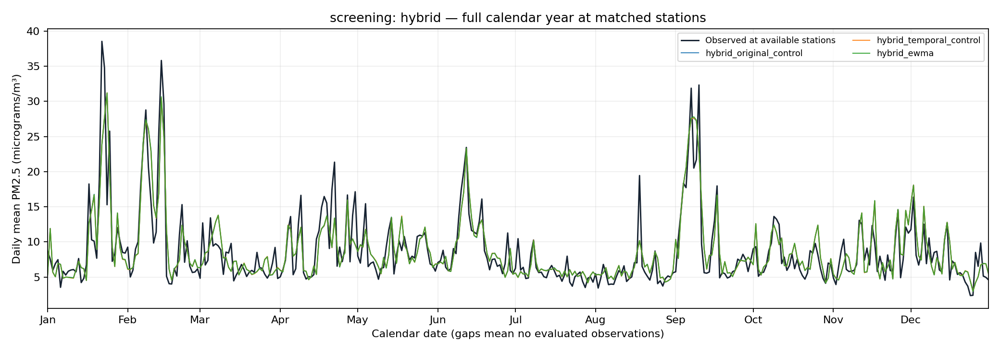
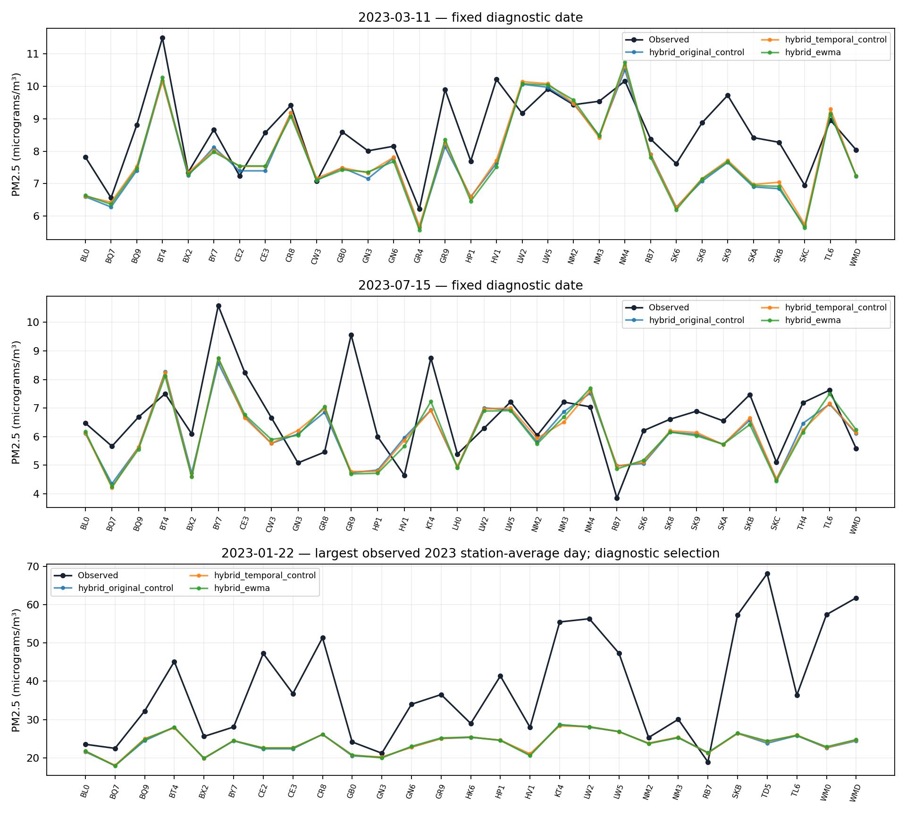
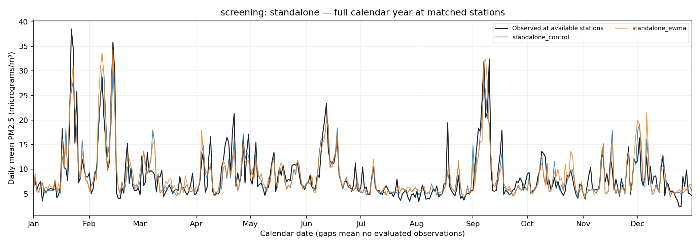
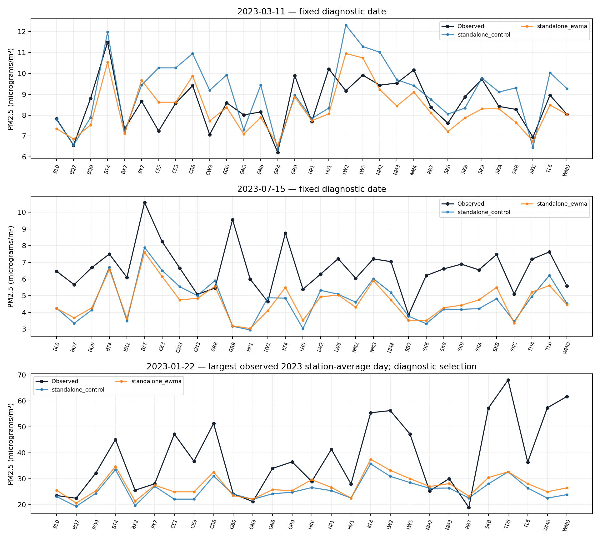

# Temporal smoothing and peak sensitivity — experiment report

Run status: **complete**.

## Verdict and safeguards

This experiment preserves the original PM2.5 observations. It tests historical input summaries and a small final-output loss term, not removal of pollution episodes.

Selection is based on 2023 safeguards, followed by matched-seed confirmation. Any 2024 figures are retrospective: this benchmark has previously been examined. Missing phases are not inferred or presented as completed.

- **standalone:** screened choice `None`; confirmation `False`. No candidate passed all 2023 screen guards
- **hybrid:** screened choice `None`; confirmation `False`. No candidate passed all 2023 screen guards

The official model, published performance table, dashboard and presentation are not changed by this report.

## Design and comparability

- Training: 2021–2022; validation: 2023. Only confirmed candidates are eligible for a 2021–2023 fit and unchanged-observation 2024 evaluation.
- HGB remains fixed to archived maps. The temporal hybrid is a matched rebase onto those maps, not a reproduction of the friend's differently refitted HGB experiment.
- Three-day median and one-/three-day-half-life exponential summaries retain the raw lagged input. These use yesterday and earlier, never today's PM2.5.
- The history source is already standardized/clipped; it is not a reconstructed raw concentration series. New scalers use training days only.
- Added channels start at zero weight; common parameters share initialization. Controls and candidates use the same frozen schedules and seed set.
- The extra loss, when enabled, is 0.1 times source/density-weighted squared final-output concentration error, normalized by training-target standard deviation. Hybrid final output includes the frozen 0.425 correction multiplier.
- A threshold of 25 means micrograms per cubic metre, not AQI, a measurement-error rule or a claim of safe exposure.

## Screening

All errors and bias are in micrograms/m³. Negative bias means underprediction.

| Variant | N | MAE | RMSE | R² | Bias | MAE <15 | Bias <15 | MAE ≥25 |
|---|---:|---:|---:|---:|---:|---:|---:|---:|
| hybrid_ewma | 11102 | 2.1019 | 3.1406 | 0.6934 | 0.0758 | 1.7681 | 0.4062 | 6.8669 |
| hybrid_final_loss | 11102 | 2.1023 | 3.1462 | 0.6923 | 0.0579 | 1.7660 | 0.3886 | 6.8816 |
| hybrid_median | 11102 | 2.1034 | 3.1422 | 0.6931 | 0.0724 | 1.7686 | 0.4046 | 6.9082 |
| hybrid_original_control | 11102 | 2.1042 | 3.1449 | 0.6925 | 0.0656 | 1.7682 | 0.4009 | 6.9576 |
| hybrid_temporal_control | 11102 | 2.1041 | 3.1434 | 0.6928 | 0.0677 | 1.7686 | 0.4026 | 6.9332 |
| standalone_control | 11102 | 2.1774 | 3.2410 | 0.6735 | -0.0673 | 1.8364 | 0.3063 | 7.7847 |
| standalone_ewma | 11102 | 2.2932 | 3.3654 | 0.6479 | 0.1920 | 1.9173 | 0.5189 | 7.2634 |
| standalone_final_loss | 11102 | 2.3268 | 3.4675 | 0.6262 | 0.0273 | 1.9356 | 0.3677 | 7.9257 |
| standalone_median | 11102 | 2.3096 | 3.4115 | 0.6382 | 0.1388 | 1.9318 | 0.4450 | 7.2513 |

### Matched-control comparisons

Negative error changes favour the candidate. Passing the screening guard alone is not final confirmation.

| Candidate | Control | RMSE change | Overall MAE change | High MAE change | All safeguards against this control |
|---|---|---:|---:|---:|---|
| hybrid_ewma | hybrid_original_control | -0.0043 | -0.0023 | -0.0907 | Fail |
| hybrid_ewma | hybrid_temporal_control | -0.0028 | -0.0022 | -0.0663 | Fail |
| hybrid_final_loss | hybrid_original_control | 0.0013 | -0.0019 | -0.0760 | Fail |
| hybrid_final_loss | hybrid_temporal_control | 0.0028 | -0.0018 | -0.0515 | Fail |
| hybrid_median | hybrid_original_control | -0.0027 | -0.0007 | -0.0494 | Fail |
| hybrid_median | hybrid_temporal_control | -0.0012 | -0.0006 | -0.0249 | Fail |
| standalone_ewma | standalone_control | 0.1244 | 0.1158 | -0.5213 | Fail |
| standalone_final_loss | standalone_control | 0.2265 | 0.1495 | 0.1410 | Fail |
| standalone_median | standalone_control | 0.1704 | 0.1323 | -0.5334 | Fail |

### Errors by observed concentration

| Variant | Observed band | N | MAE | RMSE | Bias | Squared-error share % |
|---|---|---:|---:|---:|---:|---:|
| hybrid_ewma | normal_below_15 | 9954 | 1.7681 | 2.4045 | 0.4062 | 52.5565 |
| hybrid_ewma | elevated_15_to_25 | 884 | 4.4371 | 5.5161 | -1.6975 | 24.5632 |
| hybrid_ewma | high_at_least_25 | 264 | 6.8669 | 9.7419 | -6.4419 | 22.8803 |
| hybrid_final_loss | normal_below_15 | 9954 | 1.7660 | 2.4042 | 0.3886 | 52.3571 |
| hybrid_final_loss | elevated_15_to_25 | 884 | 4.4615 | 5.5449 | -1.7237 | 24.7323 |
| hybrid_final_loss | high_at_least_25 | 264 | 6.8816 | 9.7658 | -6.4451 | 22.9106 |
| hybrid_median | normal_below_15 | 9954 | 1.7686 | 2.4035 | 0.4046 | 52.4567 |
| hybrid_median | elevated_15_to_25 | 884 | 4.4382 | 5.5202 | -1.7101 | 24.5747 |
| hybrid_median | high_at_least_25 | 264 | 6.9082 | 9.7657 | -6.4859 | 22.9686 |
| hybrid_original_control | normal_below_15 | 9954 | 1.7682 | 2.4031 | 0.4009 | 52.3525 |
| hybrid_original_control | elevated_15_to_25 | 884 | 4.4378 | 5.5139 | -1.7352 | 24.4774 |
| hybrid_original_control | high_at_least_25 | 264 | 6.9576 | 9.8167 | -6.5469 | 23.1701 |
| hybrid_temporal_control | normal_below_15 | 9954 | 1.7686 | 2.4030 | 0.4026 | 52.3975 |
| hybrid_temporal_control | elevated_15_to_25 | 884 | 4.4389 | 5.5162 | -1.7332 | 24.5206 |
| hybrid_temporal_control | high_at_least_25 | 264 | 6.9332 | 9.7934 | -6.5308 | 23.0819 |
| standalone_control | normal_below_15 | 9954 | 1.8364 | 2.5521 | 0.3063 | 55.5937 |
| standalone_control | elevated_15_to_25 | 884 | 4.3418 | 5.3061 | -2.1721 | 21.3416 |
| standalone_control | high_at_least_25 | 264 | 7.7847 | 10.0939 | -7.1074 | 23.0648 |
| standalone_ewma | normal_below_15 | 9954 | 1.9173 | 2.6279 | 0.5189 | 54.6676 |
| standalone_ewma | elevated_15_to_25 | 884 | 5.0409 | 5.9637 | -1.9469 | 25.0033 |
| standalone_ewma | high_at_least_25 | 264 | 7.2634 | 9.8401 | -4.9691 | 20.3291 |
| standalone_final_loss | normal_below_15 | 9954 | 1.9356 | 2.7066 | 0.3677 | 54.6277 |
| standalone_final_loss | elevated_15_to_25 | 884 | 5.0603 | 6.1101 | -1.8787 | 24.7229 |
| standalone_final_loss | high_at_least_25 | 264 | 7.9257 | 10.2182 | -6.4274 | 20.6494 |
| standalone_median | normal_below_15 | 9954 | 1.9318 | 2.6646 | 0.4450 | 54.6999 |
| standalone_median | elevated_15_to_25 | 884 | 5.0883 | 6.2122 | -1.7406 | 26.4032 |
| standalone_median | high_at_least_25 | 264 | 7.2513 | 9.6170 | -5.1134 | 18.8970 |

### Peaks and rapid changes

Rapid-change groups use same-station observations on the preceding calendar day, solely for diagnosis. They overlap the ≥25 group; squared-error shares must not be added.

| Variant | High N | High underpredicted | High SSE % | Rise ≥10 N / MAE | Fall ≥10 N / MAE | Previous day unavailable |
|---|---:|---:|---:|---:|---:|---:|
| hybrid_ewma | 264 | 233 | 22.8803 | 172 / 9.6132 | 320 / 4.9400 | 220 |
| hybrid_final_loss | 264 | 235 | 22.9106 | 172 / 9.6315 | 320 / 4.9288 | 220 |
| hybrid_median | 264 | 234 | 22.9686 | 172 / 9.6317 | 320 / 4.9276 | 220 |
| hybrid_original_control | 264 | 235 | 23.1701 | 172 / 9.6816 | 320 / 4.9039 | 220 |
| hybrid_temporal_control | 264 | 235 | 23.0819 | 172 / 9.6495 | 320 / 4.9121 | 220 |
| standalone_control | 264 | 230 | 23.0648 | 172 / 9.4329 | 320 / 3.8344 | 220 |
| standalone_ewma | 264 | 188 | 20.3291 | 172 / 7.5335 | 320 / 4.4277 | 220 |
| standalone_final_loss | 264 | 213 | 20.6494 | 172 / 9.0448 | 320 / 4.9024 | 220 |
| standalone_median | 264 | 189 | 18.8970 | 172 / 8.5280 | 320 / 4.8866 | 220 |

### Calibration by predicted concentration

These groups are based on the model's prediction, not the observed target. Sparse groups should not be overinterpreted.

| Variant | Predicted band | N | Mean predicted | Mean observed | MAE | Bias |
|---|---|---:|---:|---:|---:|---:|
| hybrid_ewma | [0, 5) | 1460 | 4.2861 | 4.6807 | 1.2729 | -0.3946 |
| hybrid_ewma | [5, 10) | 6773 | 7.0849 | 7.0440 | 1.6496 | 0.0409 |
| hybrid_ewma | [10, 15) | 1858 | 12.0246 | 11.7058 | 2.8220 | 0.3189 |
| hybrid_ewma | [15, 25) | 730 | 18.5548 | 18.0313 | 4.1966 | 0.5235 |
| hybrid_ewma | [25, infinity) | 281 | 28.6015 | 28.0079 | 7.1080 | 0.5935 |
| hybrid_final_loss | [0, 5) | 1480 | 4.2857 | 4.6761 | 1.2595 | -0.3903 |
| hybrid_final_loss | [5, 10) | 6772 | 7.0795 | 7.0584 | 1.6527 | 0.0211 |
| hybrid_final_loss | [10, 15) | 1853 | 12.0433 | 11.7583 | 2.8354 | 0.2850 |
| hybrid_final_loss | [15, 25) | 720 | 18.6500 | 18.0617 | 4.2491 | 0.5883 |
| hybrid_final_loss | [25, infinity) | 277 | 28.6587 | 28.2039 | 7.1100 | 0.4549 |
| hybrid_median | [0, 5) | 1460 | 4.2819 | 4.6812 | 1.2677 | -0.3994 |
| hybrid_median | [5, 10) | 6778 | 7.0871 | 7.0426 | 1.6532 | 0.0446 |
| hybrid_median | [10, 15) | 1856 | 12.0274 | 11.7243 | 2.8252 | 0.3031 |
| hybrid_median | [15, 25) | 731 | 18.5965 | 18.0644 | 4.1963 | 0.5321 |
| hybrid_median | [25, infinity) | 277 | 28.6061 | 28.1257 | 7.1659 | 0.4804 |
| hybrid_original_control | [0, 5) | 1453 | 4.2897 | 4.6737 | 1.2526 | -0.3840 |
| hybrid_original_control | [5, 10) | 6794 | 7.0844 | 7.0472 | 1.6569 | 0.0372 |
| hybrid_original_control | [10, 15) | 1851 | 12.0302 | 11.7306 | 2.8220 | 0.2996 |
| hybrid_original_control | [15, 25) | 729 | 18.6103 | 18.1053 | 4.2514 | 0.5050 |
| hybrid_original_control | [25, infinity) | 275 | 28.5620 | 28.1585 | 7.1284 | 0.4036 |
| hybrid_temporal_control | [0, 5) | 1466 | 4.2891 | 4.6901 | 1.2677 | -0.4010 |
| hybrid_temporal_control | [5, 10) | 6778 | 7.0888 | 7.0428 | 1.6545 | 0.0460 |
| hybrid_temporal_control | [10, 15) | 1855 | 12.0379 | 11.7518 | 2.8301 | 0.2861 |
| hybrid_temporal_control | [15, 25) | 729 | 18.6230 | 18.0848 | 4.2104 | 0.5383 |
| hybrid_temporal_control | [25, infinity) | 274 | 28.5938 | 28.2132 | 7.1803 | 0.3806 |
| standalone_control | [0, 5) | 1714 | 4.3661 | 4.9301 | 1.3779 | -0.5639 |
| standalone_control | [5, 10) | 6497 | 6.8682 | 7.0804 | 1.6676 | -0.2122 |
| standalone_control | [10, 15) | 1734 | 12.0584 | 11.6159 | 2.8082 | 0.4426 |
| standalone_control | [15, 25) | 961 | 18.5151 | 17.5115 | 4.9761 | 1.0036 |
| standalone_control | [25, infinity) | 196 | 29.4341 | 30.1192 | 6.7638 | -0.6851 |
| standalone_ewma | [0, 5) | 1422 | 4.3755 | 4.8047 | 1.3105 | -0.4292 |
| standalone_ewma | [5, 10) | 6554 | 6.9535 | 6.9771 | 1.6978 | -0.0236 |
| standalone_ewma | [10, 15) | 2072 | 11.9213 | 11.3984 | 3.1127 | 0.5229 |
| standalone_ewma | [15, 25) | 768 | 18.3794 | 17.0884 | 5.3103 | 1.2910 |
| standalone_ewma | [25, infinity) | 286 | 30.9308 | 28.0564 | 6.7821 | 2.8743 |
| standalone_final_loss | [0, 5) | 1956 | 4.2979 | 4.9496 | 1.3831 | -0.6517 |
| standalone_final_loss | [5, 10) | 6249 | 7.0485 | 7.2332 | 1.7452 | -0.1847 |
| standalone_final_loss | [10, 15) | 1770 | 11.9977 | 11.5352 | 3.1589 | 0.4625 |
| standalone_final_loss | [15, 25) | 856 | 18.4553 | 17.0016 | 5.3720 | 1.4536 |
| standalone_final_loss | [25, infinity) | 271 | 30.0424 | 27.5762 | 7.4977 | 2.4662 |
| standalone_median | [0, 5) | 1609 | 4.3301 | 4.9054 | 1.3734 | -0.5752 |
| standalone_median | [5, 10) | 6514 | 6.9702 | 7.0577 | 1.7477 | -0.0874 |
| standalone_median | [10, 15) | 1856 | 11.9948 | 11.5478 | 3.0108 | 0.4470 |
| standalone_median | [15, 25) | 840 | 18.3856 | 16.8800 | 5.1050 | 1.5056 |
| standalone_median | [25, infinity) | 283 | 31.0560 | 27.7279 | 7.6709 | 3.3281 |













## Confirmation

No saved prediction rows for this phase. No performance claim is made.

## Final

No saved prediction rows for this phase. No performance claim is made.

## Limitations and audit

- Bootstrap intervals use 5,000 paired moving seven-calendar-day resamples, retaining station-day weighting and missing calendar days. They condition on the fitted models and do not include selection or seed uncertainty.
- Full-year plots average the available matched stations each day, not the entire geographic population. Coverage changes can affect these averages.
- March 11 and July 15 are fixed diagnostic dates. The largest observed 2023 daily station mean is shown descriptively, not used to tune parameters.
- Curves show matched controls and the lowest-RMSE candidate for readability. A plotted candidate is not necessarily eligible or promoted.
- Original labels are evaluated without smoothing, capping or winsorisation. Remaining peak errors cannot by themselves establish sensor noise or an atmospheric cause.

### Budget

```json
{
  "used_seconds": 1109.936000000027,
  "limit_seconds": 7200.0,
  "accounting": "training/inference elapsed wall seconds, one batch stop latency"
}
```

### Integrity

```json
{
  "source_hashes_unchanged": true,
  "checkpoints_verified": 9,
  "common_initialization_matches": true,
  "added_weights_zero": true
}
```

Prediction hashes and recomputed metrics are in `metrics.json`. The report does not substitute for the runner's input-hash and checkpoint-contract checks.

## Research basis

1. [NIST — exponential smoothing](https://www.itl.nist.gov/div898/handbook/pmc/section4/pmc431.htm): recent values receive greater weight; retaining innovations avoids treating smooth levels as the whole signal.
2. [MathWorks — Hampel filtering](https://www.mathworks.com/help/signal/ref/hampel.html): robust filtering can also flag real extrema; a flag is not proof of invalid measurement.
3. [PyTorch — SmoothL1 loss](https://docs.pytorch.org/docs/main/generated/torch.nn.modules.loss.SmoothL1Loss.html) and [forecast scoring/loss alignment](https://arxiv.org/abs/0912.0902): objective choice affects the point prediction being learned.
4. [PM2.5 correction study](https://pmc.ncbi.nlm.nih.gov/articles/PMC7788047/): temporal correction has evidence in a different setting; not an expected effect size for this model.
5. [Time-series decomposition leakage study](https://www.nature.com/articles/s41598-024-80018-9): whole-series preprocessing can leak future information; all tested filters are causal.
6. [Seo and Gupta, 2026](https://www.nature.com/articles/s41612-026-01437-1): temporal and extreme-pollution modeling is relevant, but different data and evaluation prevent a direct score ranking.

## Numeric-precision rendering note

The frozen trainer stores exact float32 observations and prediction maps. CSV export rounds some of those numbers, enough to trip a very tight check of near-zero signed bias. After the independent audit passed, the reporting wrapper verified every row key, original observation and saved prediction, and restored their original numeric precision **in memory only**. No target, prediction file, training result, safeguard or frozen experiment code was changed. `render_audit.json` records the CSV round-trip errors and file hashes. Any final intervals in this report use restored precision; the run summary's intervals use validated CSV precision. This is a serialization correction, not a scientific change.
