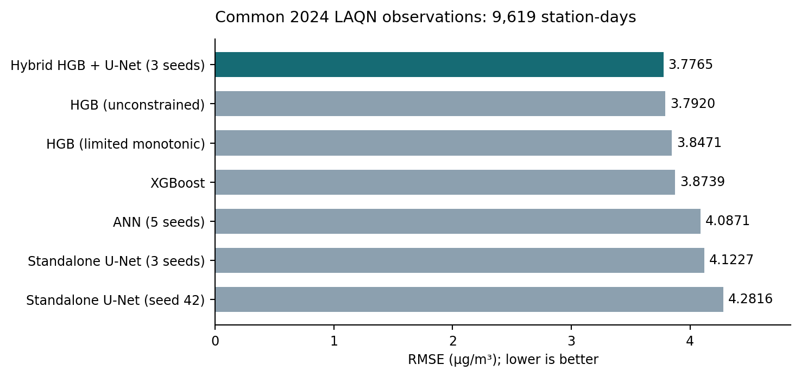

# Results and provenance

This initial release contains aggregate metrics and selected figures from the
completed local London study. No models were retrained for this release.

- [Seven-model metrics](metrics.csv): MAE, RMSE and R² on the same 9,619 LAQN
  station-days over 349 dates in 2024.
- [Figure and metric provenance](provenance.json): source identifiers and
  SHA-256 hashes for the published files.
- [Evaluation protocol](../docs/RESEARCH_PROTOCOL.md): fitting periods,
  retrospective status, uncertainty interpretation and limitations.

The aggregate metrics were checked against the locally saved station-level
predictions. Station-level observations and predictions, model checkpoints,
training code and full audit artifacts are not part of this initial release.
Consequently, this version documents the results but does not yet provide a
complete independent reproduction package.

The hybrid has the lowest numerical RMSE. Its small advantage over HGB is not
decisive under the saved descriptive paired-day analysis. The standalone
single-network result uses the pre-specified seed 42.

The example date was pre-specified before its same-day observations were
inspected for the map check. Its station scores are **day-specific**, rather
than the full-year scores. The two prediction panels share a concentration
scale; the difference and observation panels use their own labelled scales.
Map values between monitors are model estimates.
