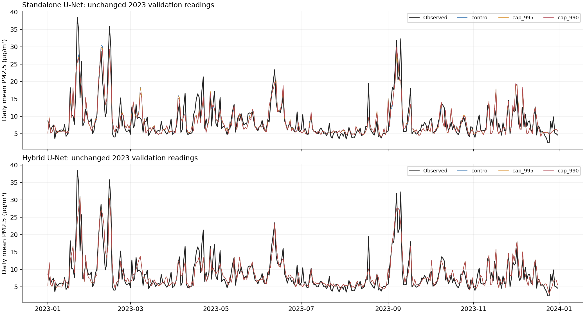

# Does capping extreme training values help the London U-Nets?

## Conclusion

Experiment status: **complete**.

- **Standalone U-Net:** cap_990 did not provide a consistent improvement on 2024; keep the existing model. Matched-control ΔRMSE: +0.0843 µg/m³. See the uncertainty interval below.
- **Hybrid U-Net:** no capping treatment passed all pre-specified 2023 criteria. Keep the existing model.

The caps modify experimental training supervision, not verified measurement errors. Every validation/test reading—including pollution episodes—remains unchanged. PM2.5 ≥25 µg/m³ is a diagnostic group, not AQI or an automatic outlier rule.

## 2023 screening: train on 2021–2022

All comparisons below use the same original LAQN observations, seed 42, fixed schedules and matched fresh initialisation. Lower MAE/RMSE is better; higher R² is better. Units are µg/m³ except R².

| Model | Training treatment | MAE | RMSE | R² | Bias | MAE ≥25 | Targets capped |
|---|---|---:|---:|---:|---:|---:|---:|
| standalone | control | 2.2155 | 3.2897 | 0.6636 | -0.0581 | 8.1180 | 0 |
| standalone | cap_995 | 2.2065 | 3.2785 | 0.6659 | -0.0478 | 8.0964 | 551 |
| standalone | cap_990 | 2.1834 | 3.2348 | 0.6747 | -0.0581 | 7.6930 | 1,101 |
| hybrid | control | 2.1044 | 3.1452 | 0.6925 | 0.0658 | 6.9546 | 0 |
| hybrid | cap_995 | 2.1052 | 3.1456 | 0.6924 | 0.0649 | 6.9678 | 551 |
| hybrid | cap_990 | 2.1045 | 3.1410 | 0.6933 | 0.0627 | 6.9987 | 1,101 |

Evaluation: **11,102 station-days**, including **264 observations ≥25 µg/m³**. Training-only caps are 43.83 µg/m³ for cap_995 and 38.58 µg/m³ for cap_990; readings below those caps are unchanged.

**Pass rule:** RMSE must decrease, while neither overall MAE nor MAE at observed PM2.5 ≥25 may increase. The lowest-RMSE eligible cap is selected; no thresholds are selected using 2024.

### Standalone: change versus its matched control

- cap_995: ΔRMSE -0.0112; ΔMAE -0.0089; Δhigh-pollution MAE -0.0217 µg/m³.
- cap_990: ΔRMSE -0.0549; ΔMAE -0.0321; Δhigh-pollution MAE -0.4250 µg/m³.

### Hybrid: change versus its matched control

- cap_995: ΔRMSE +0.0004; ΔMAE +0.0008; Δhigh-pollution MAE +0.0132 µg/m³.
- cap_990: ΔRMSE -0.0043; ΔMAE +0.0001; Δhigh-pollution MAE +0.0441 µg/m³.

## 2024 confirmation

### Standalone—three-seed ensemble

| Treatment | MAE | RMSE | R² | Bias | MAE ≥25 |
|---|---:|---:|---:|---:|---:|
| control | 2.4464 | 4.0592 | 0.4430 | -1.2845 | 15.9819 |
| cap_990 | 2.4728 | 4.1435 | 0.4196 | -1.2778 | 16.7066 |

Candidate minus control RMSE: +0.0843 µg/m³; paired seven-day-block 95% interval [+0.0016, +0.1790] (5,000 resamples). This interval is entirely above zero: the capped model has worse RMSE under this resampling analysis.

Evaluation uses **9,619 unchanged station-days**, including **216 observations ≥25 µg/m³**. The selected training-only cap is **35.7735 µg/m³**, affecting **2,035 training cell-days**. The three members use seeds 42, 11 and 22; each capped member has a matched freshly trained control.

| Treatment | MAE below 25 | RMSE ≥25 | Bias ≥25 |
|---|---:|---:|---:|
| control | 2.1354 | 17.1960 | -15.9731 |
| cap_990 | 2.1458 | 17.9644 | -16.7008 |

The same pre-specified 2024 dates are shown for both treatments: 15 July (ordinary-day example) and 11 March (previously diagnosed severe episode). These dates were not used to choose the cap.

| Date | Treatment | Stations | Observed mean | Predicted mean | Station RMSE |
|---|---|---:|---:|---:|---:|
| 2024-07-15 | control | 24 | 7.291 | 5.427 | 2.313 |
| 2024-07-15 | cap_990 | 24 | 7.291 | 5.602 | 2.139 |
| 2024-03-11 | control | 33 | 34.763 | 9.216 | 25.731 |
| 2024-03-11 | cap_990 | 33 | 34.763 | 8.656 | 26.293 |

## Ordinary days and high-pollution episodes

The figure shows all 2023 days, not only selected successes. Observed and predicted lines are daily means across the same evaluated LAQN stations.

### Standalone daily examples

15 July is the fixed ordinary-day example. 2023-01-22 is the highest observed daily mean in this development year (descriptive episode selection, not an independent test).

| Date | Treatment | Stations | Observed mean | Predicted mean | Station RMSE |
|---|---|---:|---:|---:|---:|
| 2023-07-15 | control | 30 | 6.655 | 4.760 | 2.316 |
| 2023-07-15 | cap_995 | 30 | 6.655 | 4.780 | 2.284 |
| 2023-07-15 | cap_990 | 30 | 6.655 | 4.704 | 2.325 |
| 2023-01-22 | control | 27 | 38.539 | 25.671 | 17.580 |
| 2023-01-22 | cap_995 | 27 | 38.539 | 25.500 | 17.710 |
| 2023-01-22 | cap_990 | 27 | 38.539 | 25.614 | 17.621 |

### Hybrid daily examples

15 July is the fixed ordinary-day example. 2023-01-22 is the highest observed daily mean in this development year (descriptive episode selection, not an independent test).

| Date | Treatment | Stations | Observed mean | Predicted mean | Station RMSE |
|---|---|---:|---:|---:|---:|
| 2023-07-15 | control | 30 | 6.655 | 6.107 | 1.332 |
| 2023-07-15 | cap_995 | 30 | 6.655 | 6.054 | 1.341 |
| 2023-07-15 | cap_990 | 30 | 6.655 | 6.151 | 1.305 |
| 2023-01-22 | control | 27 | 38.539 | 23.822 | 19.341 |
| 2023-01-22 | cap_995 | 27 | 38.539 | 23.829 | 19.356 |
| 2023-01-22 | cap_990 | 27 | 38.539 | 23.853 | 19.342 |

## Integrity, limitations and reproducibility

- Original input/reference hashes unchanged: **True**.
- Validation observations unchanged: **True**.
- Training/inference budget used: 30.3 minutes (not total implementation time).
- No HGB, ANN or XGBoost retraining. No new data, feature changes or architecture changes.
- All new experiment files are inside Aitken; original observations, dashboard, published model table and presentation were left unchanged.
- The screen is one seed on previously used 2023 validation data, not independent proof of generalisation. Three-seed confirmation is conditional on passing the gate.
- The fixed-schedule, deterministic matched controls may differ slightly from historic runs. Compare treatments against these controls, not unmatched old numbers.
- The block interval captures variation across calendar-day blocks for these fitted ensembles, not uncertainty across all possible training runs or future cities.
- The 2024 benchmark was already examined previously; any confirmation there is retrospective. No performance guarantee or universal superiority claim is made.

[Experiment protocol and commands](../../experiments/outlier_sensitivity/README.md) · [Source provenance](../../experiments/outlier_sensitivity/PROVENANCE.md)

[Independent saved-output audit](audit.json) verifies original labels, checkpoints, matched initialisation and recalculated scores.

Method reference: [SciPy winsorisation](https://docs.scipy.org/doc/scipy/reference/generated/scipy.stats.mstats.winsorize.html). This runner uses NumPy linear-interpolated percentiles followed by an upper cap, not a direct call to SciPy’s rank-based function.
